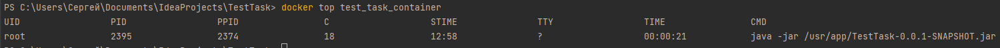
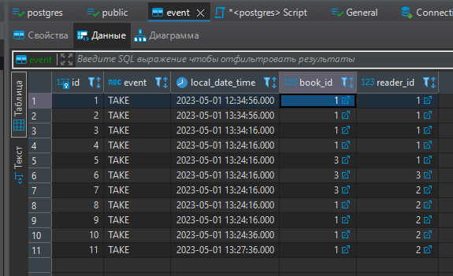
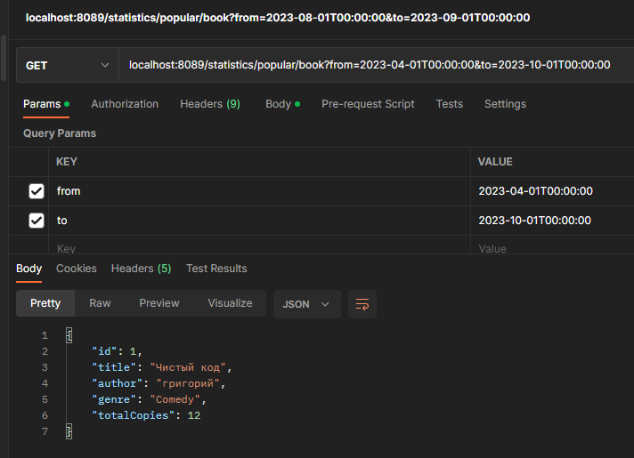
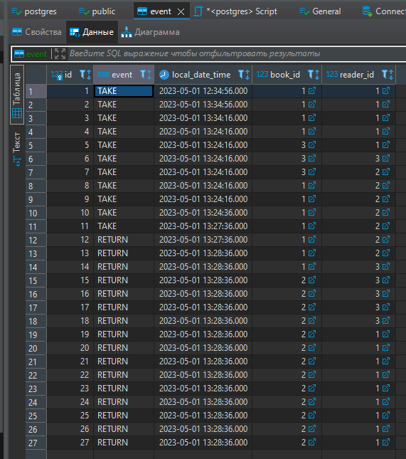
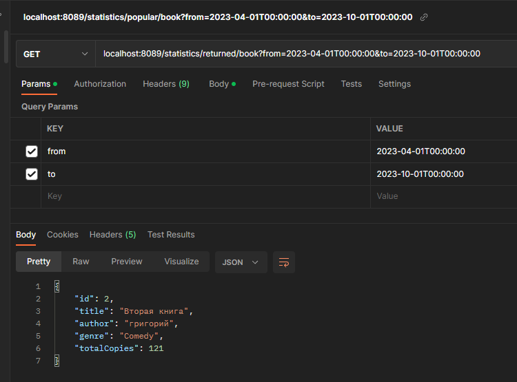
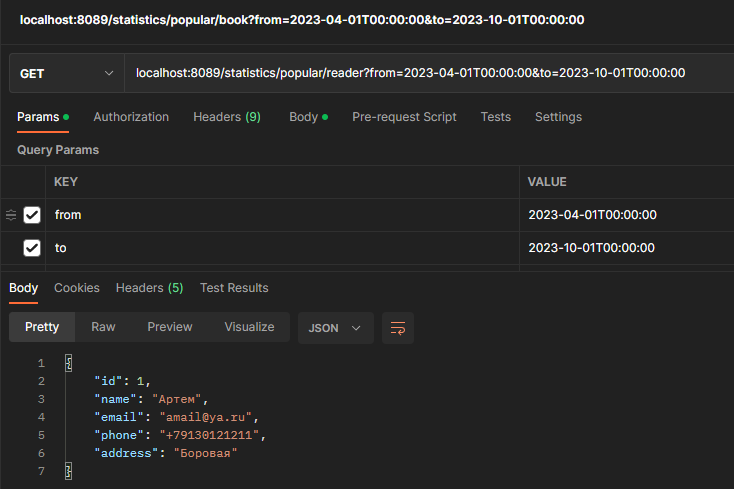
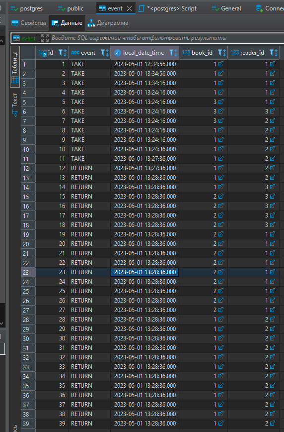
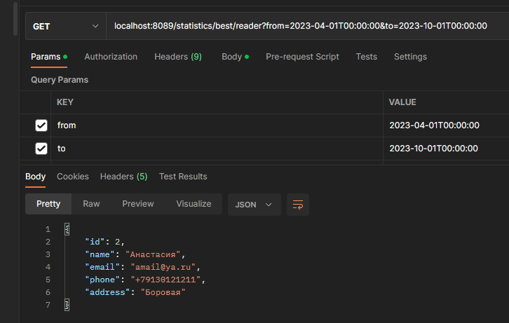

# Test Task project

## Приложение-помощник библиотекаря.
В системе существуют две основные сущности: читатель и книга.
Нужно реализовать:
- Rest-сервис для создания, редактирования, получения информации о читателях
- Rest-сервис для создания, редактирования, получения информации о книгах
- Rest-сервис для сохранения событий о том, что читатель взял книгу домой/ отдал ее назад
- Поиск самой популярной книги за определенный период времени
- Поиск читателя, прочитавшего самое большое количество книг за определенный период времени
- Интеграционные тесты
- Инструкция по запуску приложения

Пользовательский интерфейс не нужен, достаточно только бэкенд-сервисов.

## Инфо
- Java
- Postgres
- Git-flow

## Тесты
```main:```


```develop:```


## Запуск

- Прописать в application.properties и Dockerfile параметры для запущенного Postgres сервера (адрес, порт, имя, пароль...)

## Docker

Создать сеть: ```docker network create docker_network_test_task```

Сборка образа: ```docker build -t test_task_image .```

Запуск контейнера: ```docker run -d --name test_task_container --network docker_network_test_task test_task_image```

Просмотр процессов, активных в контейнере: ```docker top test_task_container```



### Примеры запросов в Postman

**POST запрос для создания книги**

```localhost:8089/book/create```

body: ```
{
"title": "Чистый код",
"author": "григорий",
"totalCopies": 12,
"genre": "Comedy"
}```

**DELETE запрос для удаления книги** 

```localhost:8089/book/delete/1```

**GET запрос для получения информации о книге** 

```localhost:8089/book/2```

**PUT запрос для обновления информации о книге** 

```localhost:8089/book/2```

body: ```
{
"title": "Чистый код",
"author": "Григорий",
"totalCopies": 12121212,
"genre": "Comedy"
}```

**POST запрос для создания читателя**

```localhost:8089/reader/create```

body: ```
{
"address": "Боровая",
"email": "amail@ya.ru",
"name": "Артем",
"phone": "+79130121211"
}```

**DELETE запрос для удаления читателя** 

```localhost:8089/reader/delete/1```

**GET запрос для получения инфы о читателе** 

```localhost:8089/reader/2```

**PUT запрос для обновления информации о читателе** 

```localhost:8089/reader/2```

body: ```
{
"address": "Боровая 111",
"email": "email@ya.ru",
"name": "Анастасия",
"phone": "+79130121211"
}```

**POST запрос для создания event - возврат книги или взятие**

```localhost:8089/event```

body: ```
{
"event": "TAKE",
"book": {
"id": 3
},
"reader": {
"id": 1
},
"localDateTime": "2023-08-01T12:34:56"
}```

**GET запрос - самая популярная книга в библиотеке (которую больше всего брали) за определенное время** 

```localhost:8089/statistics/popular/book?from=2023-01-01T12:34:56&to=2023-01-11T12:30:56```

**SQL запрос - самая частовстречаемая книга в журнале событий (без привязки к типу операции)** 

```
SELECT b.*
FROM book b
JOIN event e ON b.id = e.book_id
WHERE e.local_date_time BETWEEN CAST(:from AS timestamp) AND CAST(:to AS timestamp)
GROUP BY b.id
ORDER BY COUNT(e.id) DESC
LIMIT 1;
```





**GET запрос - получение самой возвращаемой книги в библиотеку за определенное время**

```localhost:8089/statistics/returned/book?from=2023-01-01T12:34:56&to=2023-01-11T12:30:56```





**GET запрос - нахождение человека, кто чаще всего брал книги в библиотеке за определенное время**

```localhost:8089/statistics/popular/reader?from=2023-01-01T12:34:56&to=2023-01-11T12:30:56```



**GET запрос - нахождение человека, кто чаще всего возвращал книги в библиотеку за определенное время (кто больше всех прочитал книг)**

```localhost:8089/statistics/best/reader?from=2023-01-01T12:34:56&to=2023-01-11T12:30:56```



